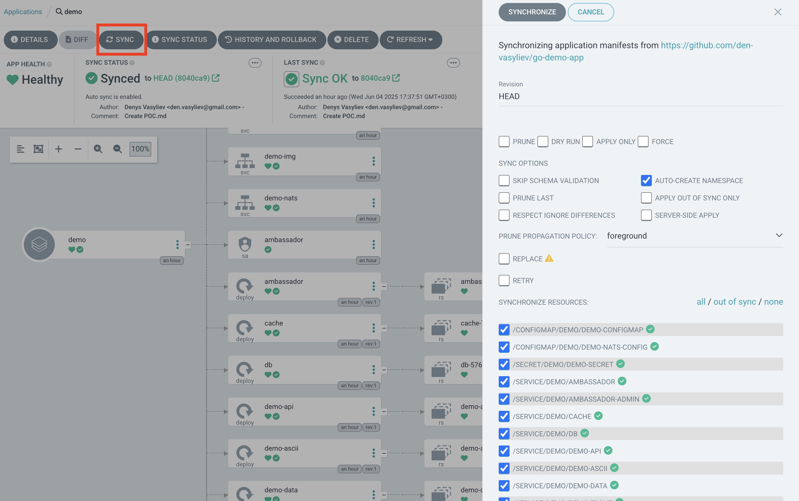

#### AsciiArtify
1. Login in ArgoCD and press "NEW APP"


2. In windows that opened, fill in the fields:
- **Application Name**: demo
- **Sync Policy**: automatic
- **Project Name**: default
- **Auto-create namespace**: yes
- **Repository URL**: link to the repository containing the manifests for deployment
- **Revision**: HEAD
- **Path**: helm
- **Cluster URL**: https://kubernetes.default.svc
- **Namespace**: demo

3. Press "Create" and we got an application:


4. After this, press on aplication and you will see details about it:


5. If you see that your application is out of sync, press "Sync" and choose components that you want to sync:


6. Lets change api-gateway type to LoadBalancer and check that autosync is working:


7. If everything okay and green, let's rollback to NodePort

8. Let's do port-fowarding:
  ```bash
  kubectl port-forward -n demo svc/ambassador 8082:80&
  ```
And check:
  ```bash
curl localhost:8082
k8sdiy-api:599e1af%
  ```
Download .png image:
  ```bash
wget -O g.png https://www.google.com/images/branding/googlelogo/2x/googlelogo_color_272x92dp.png
  ```
And let's upload it to our application:
  ```bash
curl -F 'image=@g.png' localhost:8082/img/
  ```
We get the result directly in the console:


URL:
- [Video demo](https://asciinema.org/a/4YfP5AKbJHQYGC3PJc6ILvmv8)
- [video of autosync argocd](../demo/argocd%20autosync.mov)
